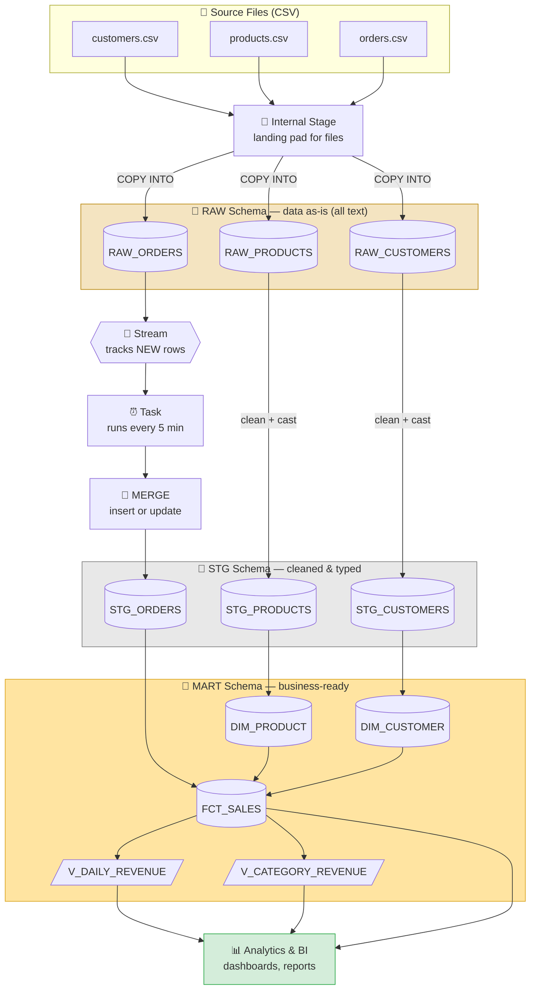

# 🏔️ Retail Sales Analytics Pipeline on Snowflake

A complete, beginner-friendly **data engineering** project built on **Snowflake**.

It takes raw sales data from CSV files, cleans it, organizes it, and turns it into
tables and queries that answer real business questions like *"Who are our best
customers?"* and *"Which products make the most money?"*

> 👋 **New to data engineering or Snowflake?** This README explains **every single
> concept** from scratch — no prior knowledge assumed. Read it top to bottom and
> you'll understand not just *what* the code does, but *why*.

---

## 📑 Table of Contents

1. [What problem does this solve?](#-what-problem-does-this-solve)
2. [Key concepts explained (start here if you're new)](#-key-concepts-explained-start-here-if-youre-new)
3. [The big picture (flowchart)](#️-the-big-picture-flowchart)
4. [Project structure](#-project-structure)
5. [Step-by-step: what each script does](#-step-by-step-what-each-script-does)
6. [How to run it yourself](#️-how-to-run-it-yourself)
7. [The sample data](#-the-sample-data)
8. [Glossary (quick reference)](#-glossary-quick-reference)

---

## 🎯 What problem does this solve?

Imagine you run an online store. Every day you get files full of information:
who your customers are, what products you sell, and what orders came in.

That raw data is **messy**:
- It has duplicate rows (the same order recorded twice).
- Some values are missing (an order with no quantity).
- Everything is stored as plain text, even numbers and dates.
- It's spread across separate files that don't "talk" to each other.

You can't answer business questions from messy data. This project builds a
**pipeline** — an automated assembly line — that takes the messy raw files and
turns them into clean, connected, trustworthy data you can actually analyze.

---

## 🧠 Key concepts explained (start here if you're new)

Before looking at any code, let's define the words you'll keep seeing. Each one
comes with a plain-English analogy.

### What is "data engineering"?

**Data engineering** is the work of moving data from where it's created (apps,
files, sensors) to where it can be analyzed, and cleaning/organizing it along the
way. A data engineer builds the "plumbing" that carries data reliably.

> 🔧 **Analogy:** A chef (the analyst) can't cook if the kitchen has no clean
> water, no gas, and ingredients scattered everywhere. The data engineer is the
> person who installs the pipes, the stove, and the pantry shelves so the chef
> can just cook.

### What is Snowflake?

**Snowflake** is a **cloud data warehouse** — a giant, powerful database that
lives on the internet (not on your laptop). You store huge amounts of data in it
and run queries to analyze that data. You pay only for what you use, and it can
handle far more data than a normal database.

> ☁️ **Analogy:** Instead of buying and maintaining your own giant filing
> cabinet, you rent space in a massive, professionally managed warehouse and pay
> per hour of use.

### What is a "data warehouse" vs a normal database?

- A **normal (transactional) database** is built for *running an app* — handling
  many small reads/writes fast (e.g. saving one customer's order).
- A **data warehouse** is built for *analyzing lots of data at once* (e.g.
  "total revenue across all 2 million orders last year"). Snowflake is a warehouse.

### ETL vs ELT (this project is ELT)

Both are ways to move data. The difference is the *order* of the steps:

- **ETL** = **E**xtract → **T**ransform → **L**oad. You clean the data *before*
  putting it in the warehouse.
- **ELT** = **E**xtract → **L**oad → **T**ransform. You load the raw data in
  *first*, then clean it *inside* the warehouse.

This project uses **ELT** because Snowflake is powerful enough to do the cleaning
itself — we load raw data first, then transform it in place. This is the modern,
common approach.

### The three-layer architecture (RAW → STG → MART)

We don't clean everything in one messy step. We build the data up in **three
layers**, each one cleaner than the last. (You may hear this called the
"medallion" or "bronze/silver/gold" pattern.)

| Layer | Nickname | What lives here | Why |
|-------|----------|-----------------|-----|
| **RAW** | Bronze / Landing | The data exactly as it arrived, untouched | If we mess up later, the original is safe here |
| **STG** | Silver / Staging | Cleaned, typed, deduplicated data | The "fixed up" version we trust |
| **MART** | Gold / Serving | Business-ready tables for reports & dashboards | What analysts and BI tools actually use |

> 🏗️ **Analogy:** RAW is the delivery of raw lumber. STG is the lumber cut,
> sanded, and sorted. MART is the finished furniture ready to sell.

### Snowflake's building blocks

These are the objects you'll create in Snowflake:

- **Warehouse** = the **compute engine** (the "muscle" that runs your queries).
  In Snowflake, "warehouse" confusingly means the *processing power*, not storage.
  You turn it on to run queries and it can auto-turn-off to save money.
- **Database** = a container that holds your data, like a big folder.
- **Schema** = a folder *inside* the database that groups related tables. We have
  three schemas: `RAW`, `STG`, `MART` — one per layer.
- **Table** = a grid of rows and columns where the actual data sits (like a
  spreadsheet tab).
- **View** = a *saved query* that looks like a table but stores no data itself —
  it just re-runs its query whenever you look at it. Great for reusable logic.
- **Role** = a set of permissions. `SYSADMIN` is a built-in role with enough
  power to create warehouses and databases.

### File format, Stage, and COPY INTO (how data gets in)

To load a CSV file into Snowflake you need three things:

- **File Format** = instructions describing how to *read* the file: "columns are
  separated by commas, skip the header row, treat empty cells as NULL." You define
  it once and reuse it.
- **Stage** = a *landing pad* — a temporary storage area where your files sit
  before being loaded into tables. Think of it as the loading dock of the warehouse.
- **`COPY INTO`** = the command that reads files from the stage and copies their
  rows into a table.

### NULL, and cleaning concepts

- **NULL** = "no value / empty / unknown." Different from zero or blank text.
- **`COALESCE(x, y)`** = "use `x`, but if `x` is NULL, use `y` instead." We use
  `COALESCE(quantity, 1)` to default a missing quantity to 1.
- **`TRY_TO_NUMBER` / `TRY_TO_DATE` / `TRY_TO_TIMESTAMP`** = safely convert text
  into a number/date/timestamp. The `TRY_` prefix means "if it can't convert,
  return NULL instead of crashing." (Raw data is all text; we convert it to real
  types here.)
- **Deduplication** = removing duplicate rows. We use a **window function**
  called `ROW_NUMBER()` to number rows within each order and keep only row #1.

### Change Data Capture: Streams and Tasks

Reloading *all* the data every time is slow and wasteful once you have millions of
rows. Instead we process only what's *new*. Two Snowflake features make this easy:

- **Stream** = a built-in **change tracker**. Point a stream at a table and it
  remembers which rows are *new* since you last looked. This is called
  **Change Data Capture (CDC)** — capturing only the changes.
- **Task** = a **scheduler**. It runs a piece of SQL automatically on a timer
  (e.g. "every 5 minutes"). We use a Task to check the Stream and process new rows.

> 🔔 **Analogy:** A Stream is like the "unread" badge on your inbox — it tells you
> exactly which messages are new. A Task is an alarm clock that says "every 5
> minutes, go read the unread messages."

### MERGE (insert-or-update in one step)

**`MERGE`** looks at incoming rows and, for each one:
- if the order already exists in the target table → **updates** it,
- if it doesn't exist yet → **inserts** it.

It's "insert or update" combined into one command. (Also nicknamed "upsert.")

### Dimensional modeling: facts, dimensions, and the star schema

This is how analysts like to organize data for reporting.

- **Dimension table** = *descriptive* "who / what / where" data. Example:
  `DIM_CUSTOMER` (names, cities), `DIM_PRODUCT` (product names, categories).
- **Fact table** = *measurable events* with numbers you add up. Example:
  `FCT_SALES` — one row per sale, with quantity and revenue.
- **Star schema** = a fact table in the middle, surrounded by dimension tables it
  connects to. Drawn out, it looks like a star. It makes queries simple and fast.

> ⭐ **Analogy:** The fact table is the *verb* ("sold 3 units"). The dimensions are
> the *nouns* ("customer Aarav", "product Coffee Mug"). Together they form a
> complete sentence you can analyze.

### Window functions (used in the analytics)

A **window function** does a calculation *across a set of related rows* without
collapsing them into one. Examples you'll see:

- `ROW_NUMBER()` — numbers rows 1, 2, 3… (used for dedup).
- `RANK()` — ranks rows by a value (e.g. top spenders).
- `AVG(...) OVER (...)` — a rolling/moving average (e.g. smooth a revenue trend).
- `NTILE(3)` — splits rows into 3 equal buckets (used for RFM scoring).

---

## 🗺️ The big picture (flowchart)

Here's the entire pipeline as a diagram. Data flows top to bottom, getting cleaner
at each stage. (GitHub renders this automatically.)



**Reading the diagram:**
1. Three CSV files are uploaded to a **Stage** (loading dock).
2. `COPY INTO` loads them into **RAW** tables, untouched.
3. Customers & products are cleaned straight into **STG**.
4. Orders flow through a **Stream** (which spots new rows) → a **Task** (timer) →
   a **MERGE** (insert/update) into `STG_ORDERS`. This is the incremental part.
5. STG feeds the **MART** star schema (dimensions + fact + views).
6. Dashboards and reports read from MART.

---

## 📁 Project structure

```
snowflake-retail-pipeline/
├── README.md                     ← you are here
├── data/                         ← tiny sample CSV files to load
│   ├── customers.csv             ← 8 customers
│   ├── products.csv              ← 8 products
│   └── orders.csv                ← 16 orders (incl. 1 duplicate + 1 missing value on purpose)
└── sql/                          ← run these in order, 01 → 06
    ├── 01_setup.sql              ← create warehouse, database, schemas
    ├── 02_raw_layer.sql          ← file format, stage, raw tables, COPY INTO
    ├── 03_staging_layer.sql      ← clean & type-cast into STG
    ├── 04_stream_task.sql        ← Stream + Task for automatic incremental loads
    ├── 05_marts_layer.sql        ← dimensions, fact table, reporting views
    └── 06_analytics_queries.sql  ← business questions answered in SQL
```

---

## 🪜 Step-by-step: what each script does

### `01_setup.sql` — Build the foundation
Creates the **warehouse** (compute engine, sized `XSMALL` and set to auto-suspend
after 60 seconds so it doesn't waste money), the **database** `RETAIL_DB`, and the
three **schemas**: `RAW`, `STG`, `MART`. This is like renting the building and
labeling the rooms before moving anything in.

### `02_raw_layer.sql` — Get the data in
Defines the reusable **file format** (how to read a CSV), creates the **stage**
(landing pad), creates the **RAW tables** (every column is `VARCHAR`/text on
purpose — so no badly-formatted row can break the load), and runs `COPY INTO` to
load the files. It ends with a row-count check so you can confirm the data landed.

> 💡 Why is everything text in RAW? Because raw data is untrustworthy. If we tried
> to force a broken date into a real date column, the whole load would fail. By
> loading as text first, *nothing* can break — we fix types in the next step.

### `03_staging_layer.sql` — Clean it up
Turns the messy RAW text into trustworthy typed data:
- Converts text to real numbers/dates using `TRY_TO_*` functions.
- Standardizes text (`INITCAP` capitalizes names nicely, `LOWER` normalizes emails).
- **Removes duplicate orders** using `ROW_NUMBER()` (keeps only the latest copy of
  each `order_id`).
- **Fills missing quantities** with `COALESCE(quantity, 1)`.
- **Keeps only valid orders** — ones whose customer and product actually exist.

### `04_stream_task.sql` — Automate incremental loading
This is the "smart" part. Instead of rebuilding `STG_ORDERS` from scratch every
time:
- A **Stream** watches `RAW_ORDERS` and remembers which rows are new.
- A **Task** wakes up every 5 minutes and, *only if the stream has new data*,
  runs a **MERGE** to insert new orders / update changed ones into `STG_ORDERS`.

The script includes a copy-paste example so you can insert a new order and watch it
flow through. ⚠️ It also reminds you to **suspend the Task** when done so it stops
consuming credits.

### `05_marts_layer.sql` — Model for analysis
Builds the **star schema**: two **dimension** tables (`DIM_CUSTOMER`,
`DIM_PRODUCT`), one **fact** table (`FCT_SALES`, with revenue pre-calculated as
`quantity × unit_price`, filtered to completed orders only), and two convenience
**views** (`V_DAILY_REVENUE`, `V_CATEGORY_REVENUE`) that BI tools can point at
directly.

### `06_analytics_queries.sql` — Answer business questions
Eight ready-to-run queries, including:
- Total revenue & order KPIs
- Top 5 products by revenue
- Revenue by city
- Daily revenue with a 3-day moving average (trend smoothing)
- Customer lifetime value, ranked
- Repeat vs one-time customers (retention signal)
- Category share of total revenue (%)
- A simple **RFM** segmentation (Recency, Frequency, Monetary scoring)

---

## ▶️ How to run it yourself

**You need:** a Snowflake account. A **free 30-day trial** at
[signup.snowflake.com](https://signup.snowflake.com) works perfectly and gives you
enough credits for this whole project.

1. **Log in** to Snowsight (Snowflake's web interface).
2. **Open a worksheet** (a place to write and run SQL).
3. **Run `01_setup.sql`** — copy its contents in and click Run. This creates your
   warehouse, database, and schemas.
4. **Run the first half of `02_raw_layer.sql`** (everything up to the `COPY INTO`
   statements) to create the file format, stage, and raw tables.
5. **Upload the CSV files** to the stage:
   - In Snowsight: go to **Data → Databases → RETAIL_DB → RAW → Stages →
     RETAIL_STAGE**, click **+ Files**, and upload the three files from `data/`.
   - *(Or, with the SnowSQL command-line tool:
     `PUT file://data/*.csv @RETAIL_DB.RAW.RETAIL_STAGE;`)*
6. **Run the `COPY INTO` statements** in `02_raw_layer.sql` to load the data.
7. **Run `03`, `04`, `05`, `06` in order.**
8. **When finished, suspend the task** so it stops running:
   ```sql
   ALTER TASK RETAIL_DB.STG.LOAD_ORDERS_TASK SUSPEND;
   ```

---

## 🧾 The sample data

The data is intentionally tiny (so you can eyeball it) and intentionally *messy*
(so the cleaning steps actually have something to fix):

- **customers.csv** — 8 customers with names, emails, cities (all in India).
- **products.csv** — 8 products across Electronics / Stationery / Home.
- **orders.csv** — 16 orders. Note two deliberate "problems":
  - Order `1008` appears **twice** (a duplicate) → the dedup logic removes it.
  - Order `1014` has a **missing quantity** → `COALESCE` defaults it to 1.

Seeing these get fixed is the best way to understand what the pipeline does.

---

## 📖 Glossary (quick reference)

| Term | One-line meaning |
|------|------------------|
| **Snowflake** | A cloud data warehouse (a big database on the internet) |
| **Data engineering** | Building the pipes that move & clean data for analysis |
| **ELT** | Extract, Load, Transform — load raw first, clean inside the warehouse |
| **Warehouse** | Snowflake's compute engine (the muscle that runs queries) |
| **Database** | A container for your data (a big folder) |
| **Schema** | A folder inside a database that groups tables |
| **Table** | A grid of rows & columns holding actual data |
| **View** | A saved query that acts like a table but stores no data |
| **Stage** | A landing pad where files sit before loading |
| **File Format** | Instructions for how to read a file (delimiter, header, etc.) |
| **COPY INTO** | The command that loads staged files into a table |
| **RAW / STG / MART** | The three cleanliness layers (bronze / silver / gold) |
| **NULL** | An empty / unknown value |
| **COALESCE** | "Use this value, or a fallback if it's NULL" |
| **TRY_TO_NUMBER/DATE** | Safely convert text to a type (NULL if it fails) |
| **Deduplication** | Removing duplicate rows |
| **Stream** | A change-tracker that remembers which rows are new (CDC) |
| **Task** | A scheduler that runs SQL automatically on a timer |
| **MERGE** | Insert-or-update rows in one command ("upsert") |
| **Dimension table** | Descriptive "who/what/where" data |
| **Fact table** | Measurable events with numbers to add up |
| **Star schema** | A fact table surrounded by dimension tables |
| **Window function** | A calculation across related rows without collapsing them |
| **RFM** | Recency, Frequency, Monetary — a customer scoring method |

---

## 📜 License

MIT — free to use, learn from, and adapt.
